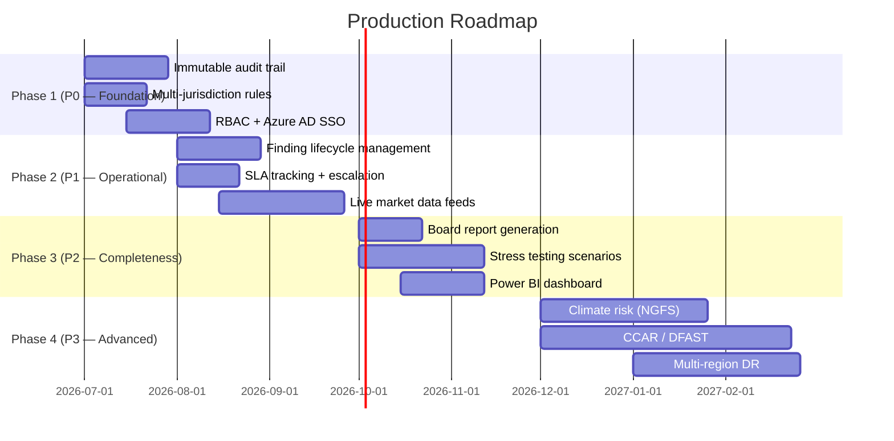

# Capital Market Risk Review — Design Document

## 1. Document Control
- **Owner:** XXX Capital Markets — Technology & Risk Engineering
- **Reviewers:** Market Risk, Counterparty Credit Risk, Model Risk, Regulatory Affairs
- **Version:** 2.0.0
- **Last Updated:** 2026-06-05
- **Status:** Implemented (agents active; external API integrations simulated)

---

## 2. Purpose and Scope

This document describes the design of the `capital_market_risk_review` LangGraph multi-agent pipeline, covering:
1. **Current implementation** — what is fully built and runnable today
2. **Production extension guide** — integration hooks and recommended next steps

### In Scope
- **Two-pipeline design**: separate ingestion (hourly/daily batch) from review (on-demand)
- Multi-fund support: each fund's documents are isolated by `fund_id` throughout
- Risk document ingestion, chunking, metadata tagging, and persistent embedding
- Fund-scoped semantic retrieval (`fund_id` filter at query time)
- LLM-driven draft summary and structured findings extraction
- Regulatory compliance checking (Basel III/IV, XXX internal limits)
- Quantitative market sensitivity enrichment (VaR, CVA, RWA)
- Automated severity-based escalation (Slack, email, ServiceNow)
- Human-in-the-Loop (HITL) review with full enriched context
- Resumable workflow with LangGraph checkpointing

### Out of Scope (current template — see §7 for roadmap)
- Persistent vector database (using module-level dict as demo store)
- Live Bloomberg / Murex / Calypso market data feeds
- Real Slack / SMTP / ServiceNow API integrations
- Enterprise authn/authz and RBAC
- Full audit database and regulatory record-keeping
- Production monitoring and LangSmith tracing

---

## 3. Architecture Overview

### 3.1 Two-Pipeline Design

The system is deliberately split into two independent LangGraph graphs:

```
┌─────────────────────────────────────────────────────────────┐
│  PIPELINE 1 — Ingestion  (hourly / daily batch per fund)    │
│                                                             │
│  for each fund, for each new risk report file:              │
│    START → ingest_node → embed_and_persist_node → END       │
│                                                             │
│  Output: chunks stored in vector DB, keyed by fund_id       │
└─────────────────────────────────────────────────────────────┘
                          │
                          │  persistent vector store
                          ▼
┌─────────────────────────────────────────────────────────────┐
│  PIPELINE 2 — Review  (on demand, per fund_id + query)      │
│                                                             │
│  retrieve (fund_id filter) → analyze → compliance_agent     │
│  → market_sensitivity_agent → escalation_agent              │
│  → human_review (HITL) → finalize → END                     │
│                                                             │
│  Output: final_summary, escalation_log, compliance_report   │
└─────────────────────────────────────────────────────────────┘
```

**Why separate?**
- Embedding is expensive — pay it once at ingest time, not on every query
- Ingestion runs continuously; reviews are event-driven
- Each pipeline can fail, retry, and scale independently
- fund_id isolation is enforced at both write-time (tag) and read-time (filter)

---

### 3.2 Folder and Modules

| Module | Responsibility |
|---|---|
| `review_process/models.py` | **Canonical review schemas**: `RiskFinding`, `ReviewState`, `empty_review_state` |
| `embedding_process/*` | **Canonical batch ingestion/embedding pipeline** (Spark-oriented, backend abstraction) |
| `review_process/retrieval.py` | `retrieve_node` using embedding backends from `embedding_process` (backend-only path) |
| `review_process/hitl.py` | `human_review_node`, `route_after_review`, `finalize_node` |
| `review_process/graph.py` | `build_review_graph()` assembly |
| `review_process/main.py` | Local demo runner that bootstraps sample docs into file backend then runs review graph |
| `review_process/api.py` | Canonical FastAPI review service module |
---

### 3.3 State Contract (`ReviewState`)

All 17 fields shared across both pipelines via `TypedDict`:

| Field | Type | Pipeline | Populated By |
|---|---|---|---|
| `fund_id` | `str` | Both | Caller — identifies which fund's docs to ingest/retrieve |
| `report_date` | `str \| None` | Ingestion | Caller — YYYY-MM-DD date of the risk report |
| `source_files` | `list[str]` | Ingestion | Caller — file paths or S3 keys |
| `messages` | `Annotated[list, add_messages]` | Both | All nodes |
| `raw_docs` | `list[str]` | Ingestion | Caller / file loaders |
| `query` | `str` | Review | Caller |
| `chunks` | `list` | Ingestion | `ingest_node` |
| `retrieved` | `list` | Review | `retrieve_node` |
| `draft_summary` | `str` | Review | `analyze_node` |
| `findings_json` | `str` | Review | `analyze_node` (JSON array) |
| `compliance_report` | `str \| None` | Review | `compliance_agent_node` |
| `market_sensitivity_report` | `str \| None` | Review | `market_sensitivity_agent_node` |
| `escalation_log` | `list[str]` | Review | `escalation_agent_node` |
| `escalation_required` | `bool` | Review | `escalation_agent_node` |
| `human_decision` | `"approve" \| "edit" \| "reject" \| None` | Review | Human via HITL |
| `edited_summary` | `str \| None` | Review | Human via HITL |
| `final_summary` | `str \| None` | Review | `finalize_node` |

---

### 3.4 fund_id Isolation — Write and Read

**At ingest time** — every chunk is tagged:
```python
Document(
    page_content=text,
    metadata={
        "source_id": f"{fund_id}_doc_{i}",
        "fund_id": fund_id,        # ← stored in chunk metadata
        "report_date": report_date,
        "source_file": source_files[i],
    }
)
```

**At retrieve time** — strict fund_id-scoped retrieval from embedding backends:
```python
# review_process/retrieval.py
backend = _build_backend(os.getenv("REVIEW_VECTOR_BACKEND", "auto"))
retrieved = backend.similarity_search(fund_id=fund_id, query=query, k=8)
```

Review-time retrieval is intentionally decoupled from in-process ingestion state.

Fund A's documents are **never visible** when reviewing Fund B.

---

### 3.5 Persistent Store — Current vs Production Path

| | Current review path | Production target |
|---|---|---|
| Store used by `review_process/retrieval.py` | `FileFundVectorStore` (`.local_data/fund_chunks.jsonl`) or `PGVectorFundStore` | `PGVectorFundStore` |
| Persistence scope | Cross-run local file (phase 1) | Cross-process, durable |
| Deduplication | Not built into file backend | Add `RecordManager` with `cleanup="incremental"` |
| fund_id filtering | Backend-level `similarity_search(fund_id=...)` | Same |
| Index size control | Manual file management | Report date TTL / retention policy |

---

### 3.6 Ingestion Path Detail

```
embedding_process (canonical batch embedding path)
  Input:  fund-scoped files (for example MinIO text files)
  Action: Spark semantic chunking + embedding + persistence through vector backend abstraction
          (FileFundVectorStore phase 1; PGVectorFundStore target)
  Output: persisted store consumed by review_process/retrieval.py

review_process/main.py (local demo helper)
  Action: bootstrap sample documents into FileFundVectorStore for demo-only runs
```

#### 3.6.1 Chunking Strategy Design Decision

The ingestion pipeline uses a semantic recursive splitter in `embedding_process/spark_pipeline.py` instead of fixed-width character windows.

| Concern | Decision |
|---|---|
| Split boundaries | Prefer section breaks, Markdown headings, paragraphs, lines, sentences, clauses, words, then character fallback |
| Budget unit | Treat `chunk_size` and `chunk_overlap` as approximate token budgets through a lightweight tokenizer estimate |
| Defaults | `chunk_size=600`, `chunk_overlap=100` approximate tokens |
| Context preservation | Use overlap and preserve inferred `section_title` metadata for retrieval attribution |
| Spark compatibility | Keep chunking inside the existing Spark UDF contract and explode one output row per chunk |
| Guardrails | Reject non-positive chunk size, negative overlap, and overlap greater than or equal to chunk size |

**Rationale:** capital-market risk reports often contain dense clauses, bullet lists, section headings, and regulatory references. Recursive semantic splitting keeps related risk context together better than raw character windows, while approximate token budgeting aligns chunks more closely with embedding and LLM context constraints.

**Metadata added per chunk:**
- `section_title` — best-effort heading inferred from the chunk or carried forward from the prior chunk.
- `token_estimate` — lightweight token count estimate for auditability and future tuning.

---

### 3.7 Review Node Detail
 
 ```
 retrieve_node
   Input:  fund_id, query
  Action: Load retrieval backend from review_process configuration
          (REVIEW_VECTOR_BACKEND=auto|file|pgvector)
          Read persisted chunks created by embedding_process
          similarity_search(query, k=8) scoped by fund_id
          Return empty retrieval list when store is missing or fund has no hits
   Output: retrieved (list[Document])
 
analyze_node → compliance_agent_node → market_sensitivity_agent_node
            → escalation_agent_node → human_review_node → finalize_node
   (same as v1 — see §3.8–3.11)
 ```

---

### 3.8 Agent Design — Agentic Tool-Calling Loop

Each agent uses the same ReAct pattern:
```python
response = llm_with_tools.invoke(messages)
for _ in range(max_iterations):
    messages.append(response)
    if not response.tool_calls:
        break
    for tc in response.tool_calls:
        result = tool_executor[tc["name"]].invoke(tc["args"])
        messages.append(ToolMessage(result, tool_call_id=tc["id"]))
    response = llm_with_tools.invoke(messages)
```

---

### 3.9 Regulatory Compliance Agent Tools

| Tool | Regulation Ref | Key Logic |
|---|---|---|
| `check_basel_threshold` | BCBS 352 / 325 / 238 / SR 11-7 | Observed metric vs threshold dict → `BREACH/COMPLIANT` |
| `get_xxx_risk_appetite` | XXX CM Internal Policies v3–v5 | Returns internal limits + escalation owner |
| `generate_remediation_recommendation` | Above + OSFI | Owner, SLA, regulatory ref, escalation flag |

---

### 3.10 Market Sensitivity Agent Tools

| Tool | Regulation Ref | Key Logic |
|---|---|---|
| `calculate_var_delta` | BCBS 352 (IMA) | `VaR = position × daily_vol × z_score × √period`; capital = VaR × 3.0 |
| `estimate_cva_exposure` | BCBS 325 | `CVA = PD × LGD × EPE × market_factor`; capital = CVA × 1.5 |
| `calculate_rwa_impact` | BCBS 424 / CRR2 SA | `RWA = EAD × risk_weight`; Pillar 1 = 8%, CCB = 2.5% |

---

### 3.11 Escalation Agent Routing Matrix

| Severity | Slack | Email | ServiceNow | SLA |
|---|---|---|---|---|
| `critical` | `#xxx-cm-critical-risk-alerts` | Chief Risk Officer | P1 - Critical | Immediate |
| `high` | `#xxx-cm-risk-alerts` | Head of Risk (by category) | P2 - High | 3 business days |
| `medium` | `#xxx-cm-risk-monitoring` | — | — | 5 business days |
| `low` | `#xxx-cm-risk-log` | — | — | Log only |

### 3.12 REST API Layer (`review_process/api.py`)

The review pipeline is exposed as a FastAPI service. Ingestion/embedding is handled separately by `embedding_process` batch jobs.

| Method | Path | Calls | Returns |
|---|---|---|---|
| `GET` | `/health` | — | `{"status": "ok"}` — liveness probe |
| `POST` | `/review/start` | `build_review_graph().invoke()` until HITL pause | `thread_id` + all agent outputs |
| `POST` | `/review/{thread_id}/resume` | `build_review_graph().invoke(human_decision)` | `final_summary` |
| `GET` | `/review/{thread_id}/status` | `review_graph.get_state()` | current `human_decision`, `final_summary`, `escalation_required` |

**Request / Response flow:**

```
Client                     FastAPI (review_process/api.py)         LangGraph
  │                                       │                           │
  │  POST /review/start                   │                           │
  │  { fund_id, query }  ────────────────►│  build_review_graph()     │
  │                                       │  .invoke(state, config) ──►│
  │                                       │                           │ retrieve
  │                                       │                           │ → analyze
  │                                       │                           │ → compliance_agent
  │                                       │                           │ → market_agent
  │                                       │                           │ → escalation_agent
  │                                       │◄── paused state ──────────│ [HITL interrupt]
  │◄── { thread_id, draft_summary,        │
  │      compliance_report,               │
  │      escalation_log, ... }            │
  │                                       │
  │  POST /review/{thread_id}/resume      │
  │  { human_decision: "approve" } ──────►│  .invoke({human_decision},│
  │                                       │           config) ────────►│ finalize_node
  │◄── { final_summary }  ────────────────│◄── final state ───────────│
```

**Pydantic models** (`ReviewStartRequest`, `ResumeRequest`) validate all inputs before passing to LangGraph, preventing invalid state from entering the pipeline.

---

## 4. Architecture Decisions

| Decision | Choice | Rationale |
|---|---|---|
| Two separate execution paths | `embedding_process` (batch) + `build_review_graph` (on-demand) | Decouples batch cadence from review requests; independent scaling |
| fund_id tagging at ingest | Chunk metadata `fund_id` field | Enables vector store filter at retrieval — no cross-fund leakage |
| Semantic chunking | `RecursiveCharacterTextSplitter` with approximate token length and section metadata | Preserves risk narrative boundaries better than fixed character windows and improves retrieval attribution |
| Phase-1 persistence | `FileFundVectorStore` | Zero-infra local persistence with deterministic behavior |
| Upgrade target persistence | `PGVectorFundStore` | Durable, cross-process storage and scalable retrieval |
| Agent pattern | ReAct tool-calling loop | Deterministic tool selection; auditable reasoning chain |
| LLM | `gpt-4o-mini` | Cost-efficient for template; swap to `gpt-4o` for production |
| Checkpointing | `MemorySaver` | In-process HITL; `EXTEND` to `SqliteSaver/PostgresSaver` |
| API framework | FastAPI | Async, typed, auto-generates OpenAPI / Swagger docs |
| Container runtime | Two Docker images (`review-api`, `embedding-job`) | Separates long-running API runtime from scheduled Spark batch runtime |
| Deployment target | `review-api`: managed container service (OCP/AKS/Container Apps); `embedding-job`: scheduler-driven batch (Airflow/Databricks/CronJob) | Matches workload lifecycle and scaling model |
| CI/CD | GitHub Actions builds and publishes both images | Independent release cadence with shared repo and versioning |
| Secrets | Platform-native secret management | Option A: OpenShift/Kubernetes Secret or Vault; Option B: Databricks Secret Scopes + Azure Key Vault |

---

## 5. Known Gaps / Production Risks

| # | Gap | Impact | Mitigation |
|---|---|---|---|
| 1 | File backend is not enterprise durable | Local file constraints and operational risk | Replace with PGVector |
| 2 | No deduplication in current file backend writes | Duplicate chunks on re-run | Add `RecordManager` with `cleanup="incremental"` |
| 3 | No TTL on stored chunks | Index grows unbounded | Add report_date TTL policy |
| 4 | Simulated Slack / email / ServiceNow | Notifications not delivered | Wire real API clients |
| 5 | Market data is static / simulated | VaR/CVA figures not live | Connect Bloomberg BLPAPI |
| 6 | No RBAC on HITL approval | Any caller can approve | Add reviewer identity + RBAC |
| 7 | Findings are LLM-generated JSON text | Schema may drift | Add `RiskFinding.model_validate_json()` |
| 8 | `MemorySaver` lost on restart | HITL checkpoint not durable | Replace with `PostgresSaver` |
| 9 | Basel thresholds hardcoded | Rules become stale | Connect Bloomberg Regulatory |
| 10 | Token counts are lightweight estimates | Counts may differ from a specific embedding tokenizer | Replace `_estimate_tokens()` with model-specific tokenizer if strict budgets are required |

---

## 6. Production Extension Guide

### 6.1 Replace File Backend with PGVector (`embedding_process/vector_backend.py`)
```python
from langchain_postgres.vectorstores import PGVector
import os

vector_store = PGVector(
    connection_string=os.environ["PGVECTOR_CONNECTION_STRING"],
    embedding_function=embeddings,
    collection_name="fund_risk_docs",
)

# add_documents path:
vector_store.add_documents(chunks)

# retrieval path:
retrieved = vector_store.similarity_search(
    query, k=8, filter={"fund_id": fund_id}
)
```

### 6.2 Add Deduplication with RecordManager (`embedding_process/vector_backend.py`)
```python
from langchain.indexes import SQLRecordManager, index

record_manager = SQLRecordManager(
    f"pgvector/{fund_id}", db_url=os.environ["RECORD_MANAGER_DB_URL"]
)
index(chunks, record_manager, vector_store, cleanup="incremental")
```

### 6.3 Schedule Ingestion as Airflow DAG (`embedding_process/main.py`)
```python
# airflow_dag.py
from airflow.decorators import dag, task

@dag(schedule="0 * * * *")
def fund_risk_ingestion():
    @task
    def run_embedding_process():
        # trigger embedding_process.main with process date + backend args
        ...
```

### 6.4 Real Slack / Email / ServiceNow (`review_process/escalation_agent.py`)
```python
# Slack
from slack_sdk import WebClient
WebClient(token=os.environ["SLACK_BOT_TOKEN"]).chat_postMessage(...)

# Email
import smtplib
with smtplib.SMTP_SSL("smtp.xxx.com", 465) as server: ...

# ServiceNow
import requests
requests.post(f"{SNOW_INSTANCE}/api/now/table/incident", json={...})
```

### 6.5 Durable Checkpointing (`review_process/graph.py`)
```python
from langgraph.checkpoint.postgres import PostgresSaver
checkpointer = PostgresSaver.from_conn_string(os.environ["POSTGRES_URL"])
graph = build_review_graph(checkpointer=checkpointer)
```

### 6.8 Deployment Solution Proposals (Embedding Pipeline)

**Image strategy (recommended):**
- `review-api` image (from `docker/Dockerfile.review`) for continuous API serving.
- `embedding-job` image (from `docker/Dockerfile.embedding`) for scheduled ingestion/embedding.

**Build examples:**
```zsh
docker build -f docker/Dockerfile.review -t capital-market-risk-review-api:latest .
docker build -f docker/Dockerfile.embedding -t capital-market-risk-embedding:latest .
```

This section proposes two deployment options for the `embedding_process` pipeline when source risk reports arrive as text files in MinIO (S3-compatible).

#### Option A — OCP Spark Operator + Airflow DAG (primary on-platform path)

**Target architecture**
- Source: MinIO bucket/prefix containing fund-scoped text files (for example by `fund_id` and `report_date` partitions).
- Compute: `embedding_process` runs as a Spark application on OpenShift via Spark Operator.
- Orchestration: Airflow DAG triggers the Spark job on a daily/hourly schedule.
- Storage: embeddings persisted to the configured backend (`in-memory` for phase 1; `file`/`pgvector` next).

**Execution flow**
1. Airflow scheduler starts DAG on cadence (daily or hourly).
2. `validate_inputs` task checks MinIO data availability, path conventions, and minimum file quality gates.
3. `run_embedding_spark_app` submits/monitors SparkApplication in OCP.
4. Spark job reads MinIO text files, chunks content, generates embeddings, persists by `fund_id`.
5. `validate_outputs` task checks expected counts/quality metrics (documents read, chunks created, funds processed).
6. `alert_on_failure_or_anomaly` sends alert if any validation or Spark stage fails.

**Recommended DAG task groups**
- `precheck`: source presence, schema/metadata checks, duplicate file guard.
- `compute`: Spark submit + completion monitor + retry policy.
- `postcheck`: output count reconciliation, sample retrieval smoke check.
- `notify`: success/failure notifications and escalation routing.

**Operational considerations**
- Use idempotent ingestion semantics (partition by run window and fund; avoid duplicate embedding writes).
- Capture run metadata (run_id, fund_id count, input file count, output chunk count) for auditability.
- Keep Airflow retries separate from Spark retries to avoid duplicate side effects.
- Add SLA and late-data handling (skip, backfill, or reprocess policy).

**Advantages**
- Best fit when core platform and operations are OCP/Airflow-centric.
- Full control over cluster, networking, and compliance boundaries.
- Clear integration path to existing platform governance.

**Trade-offs**
- More platform engineering overhead (operator lifecycle, Spark runtime management).
- More components to operate (Airflow + OCP + object storage + observability stack).

#### Option B — Azure Databricks + Databricks Workflows (managed Spark path)

**Target architecture**
- Source: same MinIO S3-compatible bucket/prefix.
- Compute: `embedding_process` PySpark code runs as a Databricks job.
- Orchestration: Databricks Workflows scheduled daily (or hourly if required).
- Storage: embeddings persisted through the same backend abstraction to keep review pipeline unchanged.

**Execution flow**
1. Databricks Workflow starts job on schedule.
2. Job validates MinIO connectivity and required input prefixes for the run window.
3. Job executes chunking + embedding + persistence by `fund_id`.
4. Post-run notebook/task validates output metrics and data quality thresholds.
5. Workflow sends alerts on failure, timeout, or validation drift.

**Operational considerations**
- Ensure secure network path from Databricks to MinIO endpoint (private connectivity preferred).
- Configure S3A endpoint/auth/cert trust for MinIO compatibility.
- Keep backend persistence contract identical so `review_process/retrieval.py` does not change by platform.
- Use workflow retries + alert policies with explicit timeout and concurrency controls.

**Advantages**
- Faster operational onboarding for Spark workloads (managed runtime/jobs/monitoring).
- Less Kubernetes/Spark-operator maintenance burden.
- Strong productivity for data engineering teams.

**Trade-offs**
- Higher vendor coupling to Databricks ecosystem.
- Cross-platform connectivity/security setup may be non-trivial if MinIO remains in OCP.
- Cost profile may be less predictable without strict job/cluster policies.

#### Decision Guidance

Choose **Option A** when platform ownership, compliance boundary, and operational standard are centered on OCP + Airflow.
Choose **Option B** when minimizing Spark operational overhead and accelerating data pipeline delivery is the higher priority.

Both options are compatible with the current code layout because `embedding_process` and review-time retrieval are already separated by backend abstraction.

---

## 7. Production Roadmap — Business Logic Gaps

This section documents the business features required to take the current implementation from a functional demo to a production-grade capital market risk review system used by a tier-1 bank.

### 7.1 Priority Matrix

| Priority | Feature | Effort | Impact | Section |
|---|---|---|---|---|
| **P0** | Immutable audit trail | Medium | Regulatory compliance | 7.2 |
| **P0** | Multi-jurisdiction regulatory rules | Medium | Correctness for global banks | 7.3 |
| **P0** | RBAC + SSO (Azure AD) | Medium | Security & access control | 7.8 |
| **P1** | Live market data feeds (Bloomberg) | Large | Accuracy of VaR/CVA | 7.4 |
| **P1** | Finding lifecycle management | Medium | Operational workflow | 7.5 |
| **P1** | SLA tracking + escalation | Medium | Regulatory deadlines | 7.5 |
| **P2** | Board reporting (PDF generation) | Small | Stakeholder communication | 7.9 |
| **P2** | Stress testing scenarios | Large | Risk completeness | 7.6 |
| **P3** | Climate risk (NGFS scenarios) | Large | Emerging regulation | 7.6 |
| **P3** | CCAR / DFAST (US regulatory stress) | Very Large | US-specific compliance | 7.6 |

### 7.2 Regulatory & Compliance

| TODO | Description | Current State | Target |
|---|---|---|---|
| **Multi-jurisdiction rule engine** | Support OSFI (Canada), PRA (UK), ECB (EU), MAS (Singapore), APRA (Australia) rule sets | Single `BASEL_THRESHOLDS` dict | `JURISDICTION_RULES` dict with per-regulator thresholds, reporting frequencies, and filing formats |
| **Regulatory filing generation** | Auto-generate OSFI B-2, SEC 10-K, PRA FSA047, ECB COREP formatted reports | JSON output only | XBRL, PDF, or XML filing format per jurisdiction |
| **Regulatory calendar** | Track filing deadlines per jurisdiction with penalty alerts | Not implemented | Calendar-aware scheduling with automated deadline tracking |
| **Immutable audit trail** | Append-only log with digital signatures for regulatory compliance | No persistence of review history | `AuditEntry` table: `(timestamp, user, action, before_state, after_state, digital_signature)` |
| **Model risk governance (SR 11-7)** | Full model inventory, validation status, approval workflow | Basic threshold check | Model inventory with validation dates, owner, status, and re-validation scheduling |

### 7.3 Risk Data Feeds

| TODO | Description | Current State | Target |
|---|---|---|---|
| **Bloomberg data feed** | Real-time market data via Bloomberg B-PIPE or SAPI | `SIMULATED_MARKET_DATA` dict | `MarketDataService` with Bloomberg integration |
| **Multi-vendor fallback** | Fallback chain: Bloomberg → Refinitiv → cached last-known | Single simulated source | Abstract `DataFeed` interface with fallback logic |
| **Market data validation** | Anomaly detection, stale data alerts, outlier rejection | No validation | Statistical checks (z-score, moving average deviation) |
| **Internal risk system integration** | Connect to Murex, Calypso, Algo Risk for position data | Not implemented | REST/SOAP adapters for each internal system |
| **Real-time FX feed** | Live FX rates for CVA calculations | Hardcoded USD/CAD | Real-time feed from Bloomberg or internal treasury |

### 7.4 Workflow & Approval

| TODO | Description | Current State | Target |
|---|---|---|---|
| **Multi-level approval chain** | Analyst → Manager → Director → CRO sequential approval | Single HITL step | Configurable approval matrix per finding category/severity |
| **Finding lifecycle state machine** | DRAFT → REVIEW → APPROVED → IN_REMEDIATION → VERIFIED → CLOSED | Single pass | `FindingState` enum with state transition validation |
| **SLA tracking** | Per-finding SLA clock with auto-escalation on breach | Not implemented | `sla_deadline` field + escalation trigger on timeout |
| **Remediation management** | Task assignment, due dates, evidence upload, status tracking | Generate recommendation only | Full remediation workflow with evidence attachment |
| **Risk committee meeting pack** | Auto-generate meeting materials from current findings | Not implemented | PDF/PPTX generation with finding summaries, trends, and action items |

### 7.5 Counterparty & Credit Risk

| TODO | Description | Current State | Target |
|---|---|---|---|
| **Credit limit checking** | Real-time limit check against bank's credit system | Not implemented | Integration with credit risk system via API |
| **Collateral management** | Margin call tracking and collateral position monitoring | Not implemented | Integration with collateral management system |
| **ISDA/CSA netting** | Master agreement terms parsing for net exposure calculation | Not implemented | Netting agreement template parser |
| **Wrong-way risk (WWR) flagging** | Detect correlation between exposure and credit quality deterioration | Not implemented | WWR detection heuristic + manual review flag |
| **Credit migration trigger** | Auto-reassessment on counterparty rating change | Not implemented | Rating agency feed listener + re-trigger review |

### 7.6 Stress Testing & Scenario Analysis

| TODO | Description | Current State | Target |
|---|---|---|---|
| **Historical scenario library** | Pre-defined scenarios: 2008 GFC, COVID-19, Russia sanctions, oil price crash | Not implemented | Scenario definition format with market shock parameters |
| **Reverse stress testing** | "What would break the fund?" — automated reverse stress engine | Not implemented | Binary search on risk factors to find breach points |
| **Full Greeks calculation** | Delta, Gamma, Vega, Theta, Rho per position | Basic VaR only | Greeks engine integrated with position data |
| **CCAR / DFAST compliance** | Fed-mandated stress test scenarios and reporting | Not implemented | CCAR scenario ingestion + reporting template |
| **Climate risk (NGFS scenarios)** | Transition risk + physical risk modeling per NGFS | Not implemented | Climate scenario parameterization + impact assessment |

### 7.7 Security & Access Control

| TODO | Description | Current State | Target |
|---|---|---|---|
| **RBAC** | Role-based access: Analyst, Manager, CRO, Auditor, Regulator | No authentication | Role hierarchy with permission matrix |
| **Azure AD / SSO** | Enterprise single sign-on via OAuth2 | Not implemented | `azure-identity` + OAuth2 middleware |
| **Data segregation (Chinese Wall)** | Business unit + desk + fund hierarchy with cross-wall restrictions | `fund_id` isolation only | Hierarchical data access policy |
| **Approval matrix** | Dollar limits, category limits, conflict-of-interest checks per approver | No restrictions | Configurable approval rules engine |
| **Read-only auditor role** | Immutable read-only access with full audit trail for regulators | No auditor role | Read-only API key + audit-only UI |

### 7.8 Reporting & Dashboards

| TODO | Description | Current State | Target |
|---|---|---|---|
| **Board report generation** | Executive summary PDF with charts and key metrics | JSON output only | PDF generation (ReportLab / WeasyPrint) |
| **Regulatory filing format** | XBRL, XML, or PDF per jurisdiction requirement | Not implemented | Jurisdiction-specific report templates |
| **Power BI / Tableau integration** | Real-time risk dashboard for management | Not implemented | Semantic model layer + ODBC/JDBC connection |
| **Trend analysis** | Risk metrics over time (VaR trend, breach frequency, remediation velocity) | Single snapshot | Time-series table + trend visualization API |
| **Management action tracker** | Action item registry with owner, status, due date, evidence | Not implemented | Action item CRUD + status dashboard |

### 7.9 Operational Resilience

| TODO | Description | Current State | Target |
|---|---|---|---|
| **Multi-region DR** | Active-active deployment with RTO < 1 hour, RPO < 5 minutes | Single region | Azure Primary + Secondary region with Traffic Manager |
| **Data retention** | 7-year regulatory data retention with point-in-time recovery | No backup strategy | Automated backup + retention policy + PITR |
| **Rate limiting** | Per-client API throttling to prevent abuse | Not implemented | Token bucket or sliding window rate limiter |
| **Circuit breaker** | Degraded mode when Bloomberg/PGVector/LLM API is unavailable | Not implemented | `circuitbreaker` library + fallback responses |
| **LLM fallback** | Local model (Llama, Mistral) when OpenAI API is down | No fallback | `ChatOpenAI` → `ChatOllama` fallback chain |
| **Graceful degradation** | Read-only mode when write path is unavailable | Not implemented | Health check → degrade endpoint → 200 with `degraded: true` |

### 7.10 Implementation Order


